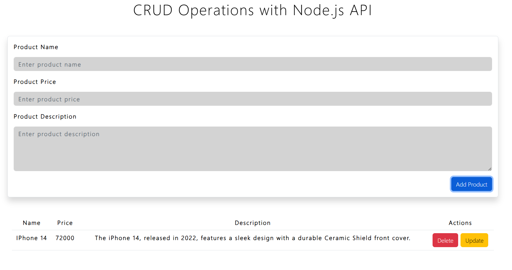

# Shopping Cart Backend and Frontend Application

This project is a simple shopping cart system built using Node.js, Express, and MySQL for the backend, along with a vanilla JavaScript frontend. It demonstrates CRUD (Create, Read, Update, Delete) operations for managing products within a shopping platform.

## Features

### Backend (Node.js + Express)
- **Product Management API:**
  - **Add Product:** Add a new product with a name, description, and price.
  - **Update Product:** Modify the details of an existing product.
  - **Delete Product:** Remove a product from the database.
  - **Get Products:** Retrieve a list of all products from the database.
- **Database:** MySQL database to store product information.
- **Middleware:**
  - `express.json()`: Parse incoming requests with JSON payloads.
  - `cors()`: Enable Cross-Origin Resource Sharing (CORS) to allow frontend requests.

### Frontend (Vanilla JavaScript)
- **Dynamic Product List:** Fetches and displays the list of products from the backend.
- **Add New Product:** Form to add new products to the list.
- **Update Product:** Edit existing products' details.
- **Delete Product:** Remove products from the list.
- **Responsive UI:** Simple and user-friendly interface to manage products.

## How to Run the Project

### Backend Setup
1. Clone the repository.
2. Install dependencies using `npm install`.
3. Set up a MySQL database named `shopping` and configure your connection details in the backend code.
4. Run the server using `node app.js`.
5. The server will be running at `http://localhost:3000`.

### Frontend Setup
1. Open the `index.html` file in your browser.
2. The frontend will interact with the backend APIs to manage the product list.

## Screenshots

### Add Product

### Delete Product

### Update Product

